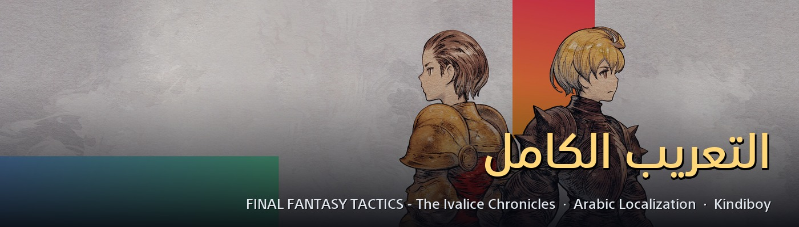
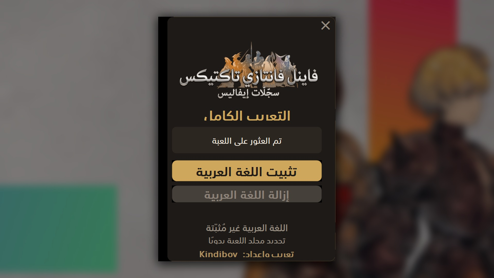

<h1 align="center">FINAL FANTASY TACTICS: The Ivalice Chronicles — التعريب الكامل</h1>

Complete Arabic localization for <b>FFT: The Ivalice Chronicles</b> (Steam, Enhanced) · تعريب كامل للعبة

  <a href="https://github.com/faisalkindi/FFT-Arabic/releases/latest/download/FFT_Arabic_Installer.zip"><b>⬇ تحميل المثبّت / Download installer</b></a>
  &nbsp;·&nbsp;
  <a href="https://github.com/faisalkindi/FFT-Arabic/releases/latest/download/FFT_Arabic_Manual.zip">ملفات التثبيت اليدوي / Manual files</a>
  &nbsp;·&nbsp;
  <a href="https://github.com/faisalkindi/FFT-Arabic/releases">كل الإصدارات / All releases</a>
  &nbsp;·&nbsp;
  <a href="https://ko-fi.com/kindiboy">☕ Ko-fi</a>

---

## العربية

**ماذا يعرّب؟** كل نصوص اللعبة: الحوارات والقوائم والأصناف والقدرات والوظائف وموسوعة العالم واليوميّات والروايات المصوّتة — إلى عربيةٍ فصحى سليمة التشكيل من اليمين إلى اليسار، بما في ذلك شعار اللعبة وترجمات مشهدي المقدمة والنهاية.

**المميزات**
- عربية فصحى بحروف متّصلة سليمة واتجاه صحيح من اليمين إلى اليسار عبر كامل الواجهة.
- شعار اللعبة بالعربية، وترجمة سرد المقدمة وخاتمة اللعبة.
- الأداء الصوتي يبقى كما هو ويتبع اختيارك من إعدادات اللعبة.
- نص الحوار الفوري مضمَّن (بلا انتظار تأثير الكتابة الحرفيّة).
- مثبّت بنقرة واحدة مع إزالة نظيفة تستعيد الملفات الأصلية من نسخة احتياطية.

**المتطلبات**
- اللعبة على Steam بوضع **Enhanced**.
- حزمة [.NET 8 Desktop Runtime](https://dotnet.microsoft.com/en-us/download/dotnet/8.0) (يحتاجها المثبّت فقط — مجانية من Microsoft).

**التثبيت (المثبّت)**
1. أغلق اللعبة.
2. حمّل `FFT_Arabic_Installer.zip` من الرابط أعلاه وفكّ الضغط، ثم شغّل `FFT Arabic Installer.exe` — يكتشف مجلد اللعبة من Steam تلقائيًا (أو حدّده يدويًا) — واضغط تثبيت.
3. داخل اللعبة: اضبط **Text Language (Enhanced) على English**، واختر لغة الصوت التي تريد.

**التثبيت اليدوي**: فكّ `FFT_Arabic_Manual.zip` داخل مجلد اللعبة (`...\steamapps\common\FINAL FANTASY TACTICS - The Ivalice Chronicles\`) بعد أخذ نسخة احتياطية من `data\enhanced\0004.en.pac` و`0007.pac` و`0008.pac`. يضع أربعة ملفات: `dinput8.dll` في جذر اللعبة و3 ملفات في `data\enhanced\`.

**الإزالة**: المثبّت ← Uninstall — يستعيد الملفات الأصلية من النسخة الاحتياطية التي أنشأها.

## English

**What it covers.** Every line in the game: dialogue, menus, items, abilities, jobs, lore entries, the journal and the in-game sound-novels — in fully-shaped, right-to-left Modern Standard Arabic, including the Arabic title logo and the opening & ending cinematic captions.

**Features**
- Proper RTL shaping and justification across the whole interface.
- Arabic title logo, and Arabic captions for the opening narration and ending epilogue.
- Original voice acting untouched — follows your in-game Voice setting.
- Instant dialogue text bundled in (no typewriter-effect waiting).
- One-click installer with a clean uninstall that restores your original files from backup.

**Requirements**
- The game on Steam, **Enhanced** mode.
- [.NET 8 Desktop Runtime](https://dotnet.microsoft.com/en-us/download/dotnet/8.0) (needed by the installer only).

**Install (installer)**
1. Close the game.
2. Download `FFT_Arabic_Installer.zip` above, unzip, run `FFT Arabic Installer.exe`; it auto-detects the Steam install (or pick the folder), then click Install.
3. In game: set **Text Language (Enhanced) → English**, and set Voice to whatever you prefer.

**Manual install**: back up `data\enhanced\0004.en.pac`, `0007.pac` and `0008.pac`, then unzip `FFT_Arabic_Manual.zip` into the game folder (`...\steamapps\common\FINAL FANTASY TACTICS - The Ivalice Chronicles\`). It places `dinput8.dll` in the game root and three `.pac` files in `data\enhanced\`.

**Uninstall**: installer → Uninstall — restores the originals from the backup it made.

## Screenshots

## Notes

- The Arabic text rides on the game's **English (.en)** language slot — keep the in-game Text Language set to English.
- Made for the **Enhanced** edition.
- Steam's "Verify integrity of game files" rolls the mod back (it replaces game files) — just re-run the installer afterwards.
- Report any typo, clipped label or mistranslation in [Issues](https://github.com/faisalkindi/FFT-Arabic/issues).
- Contributors: see [`PIPELINE.md`](PIPELINE.md) for how the text, fonts and installer are built.
- Tools credit: [FF16Tools](https://github.com/Nenkai/FF16Tools) and the FFT: The Ivalice Chronicles Mod Loader by **Nenkai**.

تعريب وإعداد: <b>Kindiboy</b>

